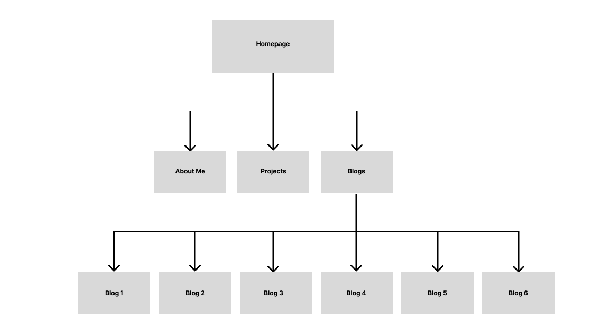

# T1A2 Portfolio - Matthew Ng

---

## [Portfolio Website](https://stately-concha-37cfb4.netlify.app/)

## [Github Repository](https://github.com/matthewngc/MatthewNg_T1A2)

---

## Purpose

The purpose of this portfolio website is to provide prospective employers with an insight into my proficiency over HTML & CSS concepts to build a functional, responsive and professional website.

## Functionality & Features

The portfolio website takes a minimalistic approach to displaying information on a webpage, with each page following a similar theme and structure. The website is easy to navigate, semantically appropriate and professionally styled.

The portfolio website navigates through four different pages:

- A landing page with a digital business card styled container showing my basic personal information, e.g. name, professional photo, contact information, etc.
- An "About Me" page detailing information on my professional and education background, along with my hobbies and interests
- A projects page describing the various projects I have worked on and will be working on in the future, and
- A blog page linking to six blog articles

## Sitemap

All pages on the sitemap, with the exception of the six blog articles, are linked and accessible through the navigation bar in the header.

Sitemap created using Figma:

## Screenshots

Homepage:

About Me:

Projects:

Blogs

Blog Article Page

## Target Audience

This portfolio website is primarily targeted towards future prospective employers in the tech & IT industry, as well as other web developers in the industry. The HTML and CSS methods utilised in this website aims to show my understanding of both languages and the ways in which to use these methods in conjunction with each other to produce a functional and responsive web interface.

## Tech Stack

Figma was used to create the sitemap and the wireframes for each individual webpage.

The portfolio website was created using HTML5 and CSS3, and the remote repository is hosted on Github.

The final version of the portfolio website was deployed and hosted on Netlify.
